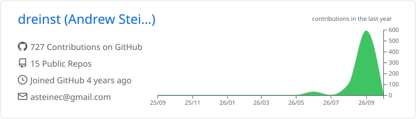
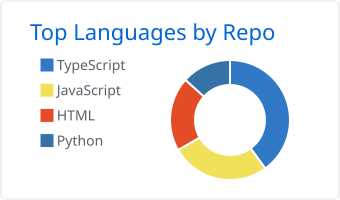
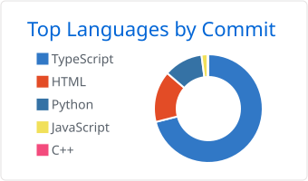

<h1 align="center">Andrew Steine Christopher</h1>

<b>Fullstack AI Engineer</b> · Malang, Indonesia

  
  
  

I build production systems for events and small businesses in Malang: registration and payment sites, admin dashboards, accounting software, WhatsApp and Telegram bots, and AI features that run on top of them. I usually own a project from the database schema to the deployment, and I keep the servers they run on healthy.

Since August 2026 I work as Fullstack AI Engineer & Technical Lead at **D'Production**, an event organizer in Malang. I am also an Information Systems student at Universitas Ma Chung.

## What I have shipped

| Project | What it does | Stack |
|---|---|---|
| [KUWERA 5K](https://kuwera5k.vercel.app) | Fun run website with registration, QRIS payment, e-tickets, and a WhatsApp bot that confirms payments | Next.js 16, Prisma, PostgreSQL |
| [Pet Blessing 2026](https://petblessings.vercel.app) | Registration for a church pet blessing event, QR check-in, and an arrival-order queue that keeps working offline | HTML, JavaScript, PostgreSQL |
| [Drive Tech](https://drive-tech-sigma.vercel.app) | Booth booking for a weekend automotive market, with a live interactive venue map and a leasing module | Next.js 15, Supabase Realtime |
| [Produksia](https://produksia.vercel.app) | Accounting system for event and wedding organizers: sales, purchasing, inventory, ledger, reports per event | Next.js 16, Prisma, PostgreSQL |
| [D'Production](https://www.dpro.events) | Company site plus an internal dashboard for events, crew assignments, and crew pay | Next.js 16, Prisma, PostgreSQL |
| [Production Book](https://easylearnn-seven.vercel.app) | A 24 week event management course with quizzes, work evidence, push reminders, and an "Ask AI" tutor | Next.js 16, Claude API |
| [LiveShuttle](https://liveshuttle.vercel.app) | Learn how driverless transport works, then watch a simulated autonomous shuttle drive around Ma Chung | JavaScript, 3D, OpenStreetMap |
| [FinnFinn](https://github.com/dreinst/finnfinnbot) | Telegram bot that reads receipts with OCR and keeps personal finance records | Python, OCR |
| [dprochatbot](https://github.com/dreinst/dprochatbot) | Event customer database with segmented WhatsApp broadcasts and opt-out handling | Node.js, SQLite |
| [MCF Photobooth](https://github.com/dreinst/mcfbooth) | Photos go straight to Google Drive and guests download them by scanning a QR code | Python, Google Drive API |

## Chatbots and automation

- WhatsApp bots that confirm payments, answer FAQs, and send reminders. Messages go through an outbox with rate limits and office hours.
- Telegram bots that turn a chat message into a finished invoice or receipt PDF, and that read receipts with OCR.
- A Discord operations bot for server status, logs, deploy windows, and approval buttons.
- LLM features built on the Claude API: a course tutor, customer service replies in the company's writing style, and AI agents that help run the servers.

## Tools I use

  

Across my repositories the code is mostly TypeScript, then JavaScript, Python, HTML and CSS, SQL (PL/pgSQL), Shell, and a little PHP, Java, and C. Most of my web work uses React through Next.js.

## Activity

  

  
  

<picture>
  <source media="(prefers-color-scheme: dark)" srcset="https://raw.githubusercontent.com/dreinst/dreinst/output/snake-dark.svg">
  
</picture>

<b>Bahasa Indonesia</b>

Saya membangun sistem produksi untuk acara dan usaha kecil di Malang: situs pendaftaran dan pembayaran, dashboard admin, software akuntansi, bot WhatsApp dan Telegram, serta fitur AI di atasnya. Biasanya saya memegang proyek dari skema database sampai deploy, dan ikut merawat server tempat semuanya berjalan.

Sejak Agustus 2026 saya bekerja sebagai Fullstack AI Engineer & Technical Lead di D'Production, event organizer di Malang. Saya juga mahasiswa Sistem Informasi di Universitas Ma Chung.

Open to freelance and collaboration. The fastest way to reach me is through [dreinst.tech](https://dreinst.tech).
